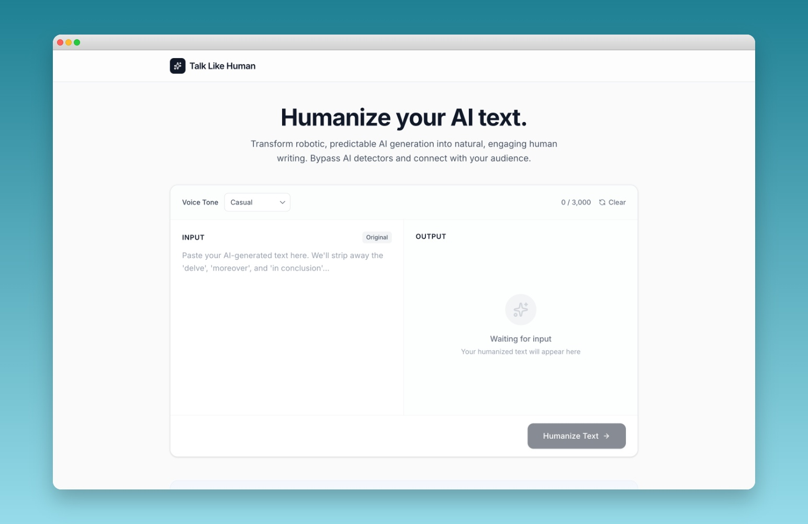

# Talk Like Human

Rewrite AI-generated or robotic text so it sounds natural, fluid, and genuinely human.



---

## Features

- Paste any AI-generated text and get a humanized version back
- Choose from 5 tone modes: Casual, Professional, Academic, Confident, Friendly
- Powered by OpenAI or Anthropic — switchable via environment config
- Skill rules fetched from an upstream source and cached server-side
- Clean, minimal interface with copy-to-clipboard support

## How It Works

The rewriting logic is based on Wikipedia's [Signs of AI writing](https://en.wikipedia.org/wiki/Wikipedia:Signs_of_AI_writing) guide, maintained by WikiProject AI Cleanup — built from observations of thousands of AI-generated texts. The humanization skill is sourced from [blader/humanizer](https://github.com/blader/humanizer).

Two key areas it targets:

- **Vocabulary triggers** — removes unnatural overuse of words like "delve", "crucial", "seamless", and "tapestry"
- **Structural patterns** — breaks up predictable paragraph lengths, symmetric lists, and repetitive sentence structures

## Tech Stack

- [Next.js](https://nextjs.org/) (App Router)
- TypeScript
- Tailwind CSS
- OpenAI API / Anthropic API

## Environment Variables

Copy `.env.example` to `.env.local` and fill in your values.

```env
LLM_PROVIDER=openai           # openai or anthropic
LLM_MODEL=gpt-4o-mini
LLM_TEMPERATURE=0.8

OPENAI_API_KEY=your_key_here
ANTHROPIC_API_KEY=your_key_here

SKILL_SOURCE=https://raw.githubusercontent.com/blader/humanizer/refs/heads/main/SKILL.md
SKILL_CACHE_TTL=600
```

## License

This project is licensed under the ```MIT license``` - see the ```LICENSE``` file for details.